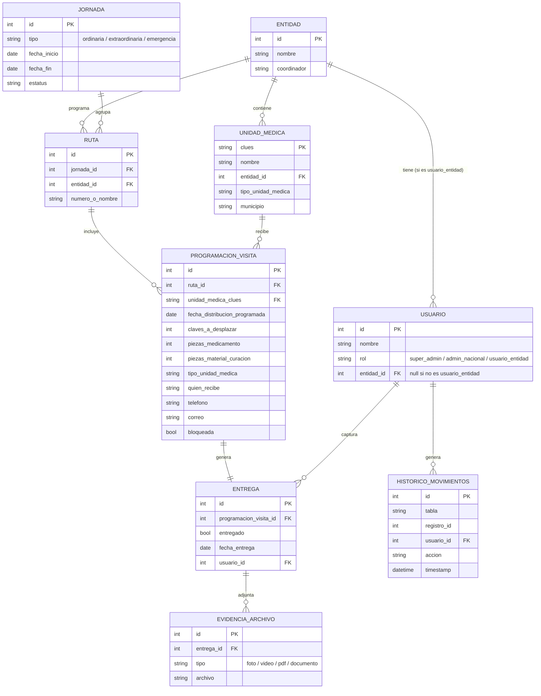

# Diagrama ER — Modelo de datos v01

> Derivado directamente de `blueprint/blueprint-v01.md` sección 5. La programación es agregada por unidad médica — no existe un catálogo de insumos como entidad relacional separada (decisión confirmada por el área requirente).

**Leyenda:** `||--o{` uno a muchos · `||--||` uno a uno (Programación ↔ Entrega, sin entregas parciales) · `PK` llave primaria · `FK` llave foránea.

## Cómo se recorre

1. Una **Jornada** nacional agrupa varias **Rutas**, una o más por **Entidad**.
2. Cada **Ruta** incluye varias **ProgramacionVisita** — una fila por unidad médica, con cantidades agregadas (no desglosadas por insumo).
3. Cada visita programada genera como máximo una **Entrega** (1 a 1: no hay entregas parciales, cada unidad se marca una sola vez).
4. Una **Entrega** puede tener cero o varios archivos de **EvidenciaArchivo** — no hay mínimo requerido.
5. **HistoricoMovimientos** es genérico: no referencia una tabla específica, registra qué tabla/registro cambió y quién lo hizo — por eso no tiene flecha directa hacia Programación o Entrega en el diagrama.

## Notas y preguntas abiertas

- **[Riesgo]** `UnidadMedica.clues` como llave primaria asume que el catálogo `CLUES_IMB.xlsx` cubre los códigos reales de programación — ya sabemos que no es así del todo (ver `blueprint/herramienta-captura-programacion-plan-v00.md`). Si una unidad no está en catálogo, este modelo necesitará permitir capturar el CLUES como texto libre igual que hace la sub-herramienta, o la FK se rompe.
- **[Campo no confirmado]** `ProgramacionVisita` no tiene un `usuario_id` propio (quién la capturó) en el blueprint — solo `Entrega` lo tiene. Vale la pena confirmar si hace falta para trazabilidad, o si `HistoricoMovimientos` genérico ya lo cubre.
- **[Sin definir]** Granularidad exacta del campo `bloqueada`: el blueprint pide poder bloquear/desbloquear edición "todas o algunas" unidades — este modelo lo resuelve a nivel de fila (cada `ProgramacionVisita`), que ya soporta bloquear individualmente o en lote, pero falta decidir si también se necesita un bloqueo a nivel **Jornada** completa como atajo.
- **[Sin definir]** `EvidenciaArchivo.archivo` es un campo genérico de referencia — dónde vive el archivo (object storage, filesystem, proveedor) sigue sin decidirse (blueprint v01, sección 9, punto 3).
